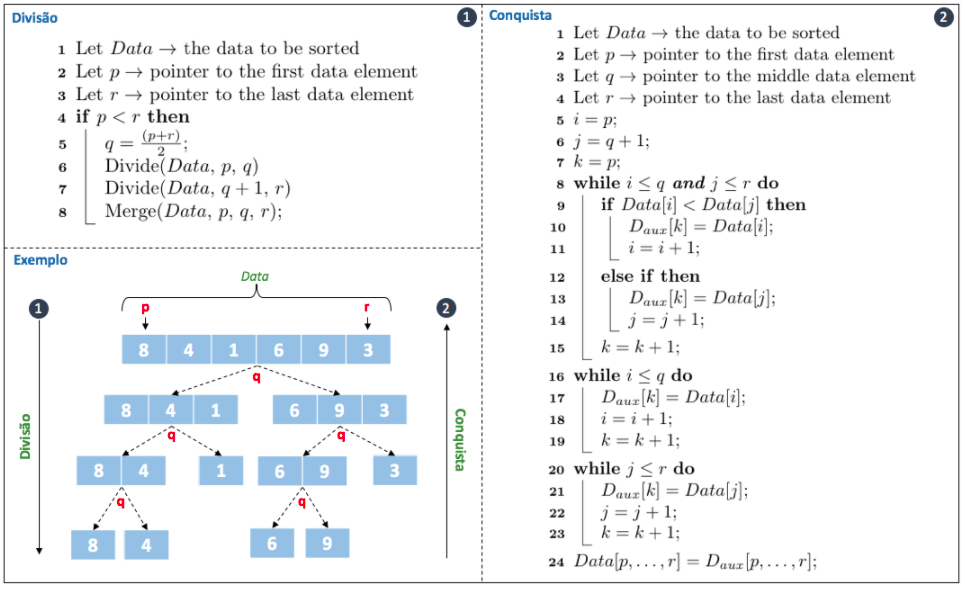

# Merge Sort: Implementação em C

 
 
 
 

 

 

O algoritmo de ordenação Merge Sort foi criado em 1945 por John Von Newmann, matemático renomado da época. Sua execução considera um processo de ordenação por sub-conjuntos, o que, segundo Newmann, produz um número menor de comparações ao decorrer da ordenação. Sua idéia se baseia em um processo chamado de Divisão e Conquista, no qual o conjunto de entrada é sub-dividido em partes menores, os quais são ordenados através de chamadas recursivas. Contudo, embora seja <b>eficiente</b> para ordenar <b>conjuntos de tamanho médio</b>, seu consumo de memória é considerável, o que o torna pouco praticável para grandes entradas e/ou conjuntos complexos de dados.

> De uma forma geral, pode-se considerar como passos fundamentais do algoritmo:
>
> - Verificar se o caso tratado não é o caso base, no qual os ponteiros de início e fim do conjunto apontam para a mesma posição. Condição que reporta a existência de um único elemento no conjunto, o que já se considera ordenado por definição. 
>
> - Para todos os casos não base, dividir a lista em duas sub listas de tamanhos equivalente, chamando o método de ordenação recursivamente para cada sub lista até alcançar o caso base.
>
>    - Executar em cada sub lista definida no segundo passo uma ordenação parcial do conjunto, seguida de um merge (i.e., junção) entre dois sub conjuntos.

Para implementar esse modelo de ordenação, é preciso definir dois métodos, um recursivo para divisão do conjunto em sub conjuntos e outro para ordenação e junção desses conjuntos menores em uma resposta ordenada. A figura abaixo detalha essas funções em pseudo algoritmo juntamente com um pequeno exemplo de execução.

	 

 

Conforme ilustrado na figura acima, o Merge Sort inicia sua execução dividindo o conjunto de elementos (i.e., etapa 1 da figura, linhas 6 e 7) até que reste apenas um único elemento por sub conjunto. Feito isso, ele inicia sucessivas chamadas da linha 8 do procedimento de divisão (i.e., etapa 1 da figura), executando em cada chamada o método de junção / conquista (i.e., Merge, etapa 2 da figura). Nessa fase, os itens da sub lista direita e sub lista esquerda são comparados, até que não reste mais sub conjuntos para avaliar. Conforme exemplo disposto na figura, haverá uma chamada para organizar os número 8 e 4 e outra chamada para organizar os números 6 e 9. Como são conjuntos unitários, estão ordenados por definição. Em um segundo momento, o algoritmo sobe um nível acima na estrutura do exemplo. Nesse ponto, tem-se o 8 e 4 que serão ordenados e o 1 que está ordenado por definição, condição igualmente realizada para os números 6,9 e 3. Já prestes a finalizar, os elementos 8, 4 e 6,9 já estão ordenados e resta organizar o 3 e o 1. Feito isso, avança-se para o nível inicial e finaliza-se a ordenação. 

  

> <b>Qual o custo envolvido com essas operações de divisão e conquista?</b>. 
>
> Por se tratar de um método recursivo, não há como realizarmos contagem de instrução para assim avaliar a complexidade desse algoritmo, então, representamos seu custo por uma função de tempo <b>T</b> considerando o tamanho da entrada em <b>N</b>. Dessa forma, tem-se como custos do MergeSort:
>
> 

>
>  
>
> 

